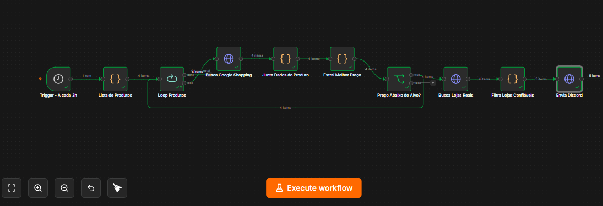

# Hardware Price Radar

Sistema automatizado para monitoramento de preços de hardware desenvolvido com **n8n**, **Docker** e **SerpAPI**.

O workflow monitora múltiplos produtos automaticamente, pesquisa ofertas em lojas confiáveis, compara os preços com um valor alvo definido pelo usuário e envia notificações para o Discord apenas quando encontra uma nova oferta abaixo do preço desejado.

---

## Tecnologias

- n8n
- Docker
- Docker Compose
- JavaScript
- SerpAPI
- Discord Webhook

---

## Fluxo



---

## Funcionalidades

- Monitoramento automático por agendamento
- Suporte a múltiplos produtos
- Pesquisa de ofertas utilizando SerpAPI
- Filtragem de lojas confiáveis
- Comparação com preço-alvo configurável
- Evita notificações duplicadas
- Envio automático de alertas para o Discord
- Seleção das ofertas mais baratas

---

## Arquitetura

```text
Scheduler
    │
    ▼
Lista de Produtos
    │
    ▼
Loop dos Produtos
    │
    ▼
Pesquisa Google Shopping
    │
    ▼
Busca de Ofertas
    │
    ▼
Filtragem
    │
    ▼
Comparação de Preço
    │
    ▼
Discord
```

---

## Como funciona

1. O workflow inicia automaticamente em um horário configurado.

2. Para cada produto da lista, é realizada uma pesquisa utilizando a SerpAPI.

3. As ofertas encontradas são filtradas para manter apenas lojas confiáveis.

4. As ofertas são ordenadas pelo menor preço.

5. O sistema compara o menor preço encontrado com o preço alvo configurado.

6. Caso exista uma oferta abaixo do valor definido, é enviada uma mensagem para o Discord.

7. O workflow registra o último preço enviado para evitar notificações repetidas.

---

## Diferenciais

- Desenvolvido totalmente no n8n
- Executado em Docker
- Monitoramento simultâneo de diversos produtos
- Sistema de prevenção de notificações duplicadas
- Filtro automático de lojas confiáveis
- Código JavaScript para tratamento inteligente dos dados

---
